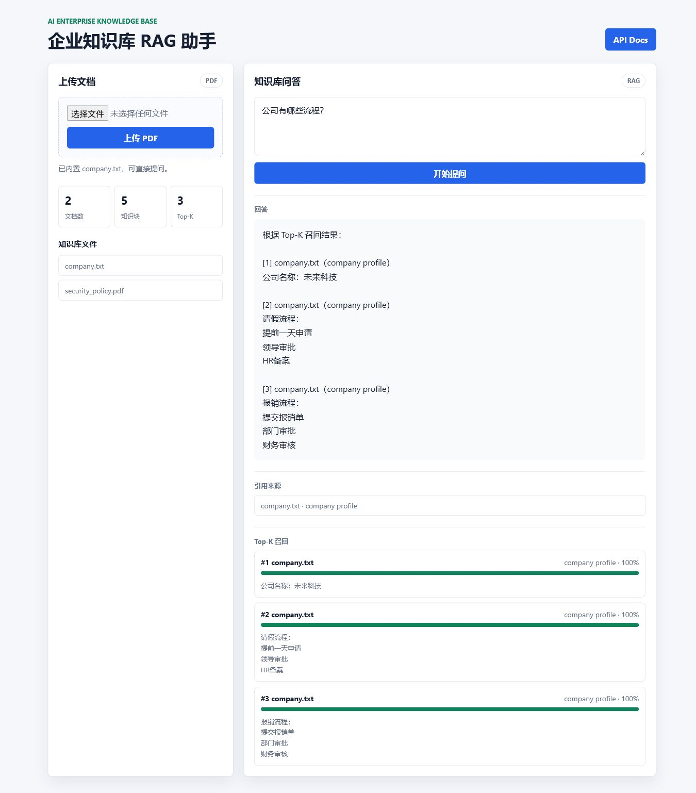
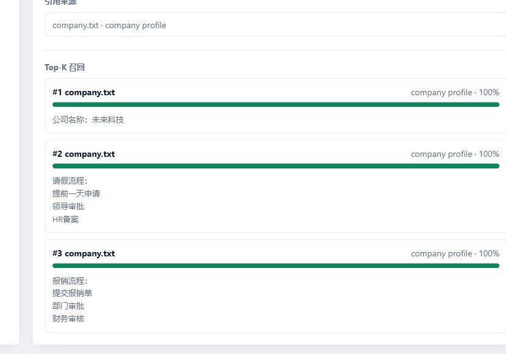

# AI 企业知识库 RAG 助手

这是一个小型企业知识库 RAG 项目。目标很直接：用户上传企业资料，输入问题，系统先做 Top-K 检索，再让模型基于召回内容回答，并把引用来源一起返回。

我没有一开始就做登录、权限、Docker 这些外围功能。这个版本先把最关键的链路做完整：**文档上传 -> 知识块切分 -> 向量检索 -> GPT 回答 -> 来源引用 -> 页面展示**。

## 项目截图

上传 PDF 后，页面会显示当前文档数、知识块数量和 Top-K 配置。下面这张图的演示环境里有 2 个文档、5 个知识块，Top-K 取 3。



Top-K 召回结果会单独展示出来，方便看清楚模型回答前到底检索到了哪些内容。



## 这个项目解决什么

企业内部经常有一类问题很具体，但查起来很烦：

- 请假流程怎么走？
- 报销要经过谁审批？
- 退款多久处理？
- 员工手册里某条制度到底怎么写？

这些信息可能散在 txt、PDF、员工手册、制度文档里。人当然可以自己翻，但真实使用时，大家更想直接问一句，然后拿到一个有出处的回答。

这个项目就是围绕这个场景做的。

## 当前功能

- 内置 `company.txt` 作为基础企业资料
- 支持上传 PDF 文档
- 支持 PDF 文本解析
- 支持文本 Chunk 切分
- 支持 OpenAI Embedding
- 支持 ChromaDB 向量检索
- 支持 GPT 基于召回上下文回答
- 支持引用来源返回
- 支持 Top-K 召回可视化
- 支持 `/stats` 查看文档数、知识块数、PDF 数量
- 支持 Web 页面和 FastAPI Swagger 文档

说白了，它还不是企业级系统，但 RAG 的主干已经能跑，也能展示。

## 技术栈

- Python
- FastAPI
- OpenAI Embeddings
- OpenAI Chat Completions
- ChromaDB
- pypdf
- HTML / CSS / JavaScript
- Uvicorn

## RAG 流程

```text
company.txt / PDF
  -> 文本解析
  -> Chunk 切分
  -> OpenAI Embedding
  -> ChromaDB 向量库
  -> 用户提问
  -> 问题向量化
  -> Top-K 相似 Chunk 检索
  -> GPT 基于上下文回答
  -> 返回答案、引用来源、召回结果
```

这里我比较在意的是“引用来源”和“Top-K 可视化”。只给一个流畅回答，其实不够像知识库；用户还要知道这个回答从哪里来，检索过程有没有靠谱。

## 可验证结果

当前截图对应的本地演示结果：

```text
文档数：2
知识块：5
PDF 数：1
Top-K：3
```

说明一下：`company.txt` 是仓库内置资料，截图里的 `security_policy.pdf` 是本地上传的演示 PDF。上传目录被 `.gitignore` 忽略，所以仓库不会把用户上传文件提交进去。

## 面试时我会怎么讲

这个项目我会按 RAG V1/V2 来讲，不会说它已经是企业级知识库。它现在最重要的价值是：上传资料后，能完成切块、Embedding、ChromaDB 检索、GPT 回答和来源引用。

如果面试官问为什么没做 OCR、登录、权限和 Docker，我会直接说：这些可以继续加，但这个阶段我先保证 RAG 主链路能跑，而且页面和截图能让人一眼看懂。

我单独放了一份 [PROJECT_NOTES.md](PROJECT_NOTES.md)，里面是我自己准备讲解时会看的笔记。

## 项目结构

```text
ai-rag-knowledge-base/
├─ app.py
├─ requirements.txt
├─ README.md
├─ data/
│  └─ company.txt
├─ static/
│  ├─ index.html
│  ├─ styles.css
│  └─ app.js
└─ screenshots/
   ├─ rag-web-demo.png
   └─ rag-topk-recall.png
```

## 快速运行

安装依赖：

```bash
pip install -r requirements.txt
```

设置 OpenAI API Key：

```powershell
$env:OPENAI_API_KEY="你的 API Key"
```

启动服务：

```bash
uvicorn app:app --reload
```

打开网页：

```text
http://127.0.0.1:8000/
```

打开接口文档：

```text
http://127.0.0.1:8000/docs
```

## 没有 API Key 怎么预览

如果只是想看页面效果和基本交互，可以开 Demo Mode：

```powershell
$env:RAG_DEMO_MODE="true"
uvicorn app:app --reload
```

这个模式主要是为了展示页面、上传和 Top-K 可视化，不等于真实的 Embedding + GPT 问答。真正的 RAG 问答还是需要配置 `OPENAI_API_KEY`。

## 接口说明

### `GET /health`

健康检查。

### `GET /documents`

查看当前知识库里的文件列表。

### `GET /stats`

查看当前知识库统计信息。

响应示例：

```json
{
  "document_count": 2,
  "chunk_count": 5,
  "pdf_count": 1,
  "top_k": 3
}
```

### `POST /upload`

上传 PDF 文档。

请求类型：

```text
multipart/form-data
```

字段：

```text
file: PDF 文件
```

### `POST /ask`

向知识库提问。

请求示例：

```json
{
  "question": "公司有哪些流程？"
}
```

响应里会返回答案、引用来源，以及 Top-K 召回内容：

```json
{
  "question": "公司有哪些流程？",
  "answer": "根据 Top-K 召回结果：...",
  "citations": [
    {
      "source": "company.txt",
      "location": "company profile"
    }
  ],
  "contexts": [
    {
      "rank": 1,
      "text": "公司名称：未来科技",
      "source": "company.txt",
      "location": "company profile",
      "score": 1.0
    }
  ]
}
```

## 我觉得这个项目最能展示的点

第一，它不是只写了一个调用 GPT 的接口。项目里有资料解析、切块、Embedding、向量检索、回答生成、来源返回和 Top-K 展示，RAG 的基本结构是完整的。

第二，它有页面和截图。面试官打开 GitHub，不需要先读很多代码，就能看到上传、提问、回答、召回结果这几个关键动作。

第三，它保留了边界。比如 PDF 解析现在只处理文本型 PDF，不做 OCR；上传文件也只是最小版本，没有做用户系统和权限。这个阶段先把主流程做好，比一上来堆很多半成品功能更重要。

## 可以写进简历的版本

> AI 企业知识库 RAG 助手：基于 FastAPI、OpenAI Embeddings、ChromaDB 实现企业文档问答系统，支持 PDF 上传、文本切块、向量检索、Top-K 召回展示和答案引用来源。项目提供 Web 页面和 Swagger API，当前演示环境可展示 2 个文档、5 个知识块、Top-K=3 的完整问答流程。

如果简历上想写得再短一点：

> 实现企业知识库 RAG Demo，支持 PDF 上传、Embedding 向量化、ChromaDB Top-K 检索、GPT 回答和引用来源展示，并提供可运行 Web 页面与项目截图。

## 后续可以继续做什么

- 支持多文件批量上传
- 支持 Word / Excel / Markdown 文档解析
- 支持 OCR 图片识别
- 支持文档删除和重新索引
- 支持对话历史
- 支持用户登录和权限控制
- 支持 Docker 部署
- 增加自动化测试和 CI

如果继续升级，我会优先做“文档管理”和“引用定位更精确”。因为这两个点更接近真实知识库，而不是只把页面做得更热闹。
